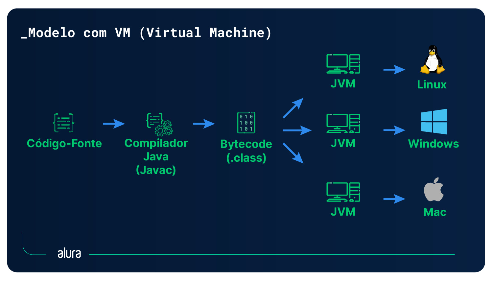

# Como Java Funciona

* **Independência de Plataforma**: Java é conhecido pelo slogan "Escreva uma vez, execute em qualquer lugar", graças à sua capacidade de rodar em diferentes sistemas operacionais.
* **Máquina Virtual Java (JVM)**: A JVM atua como uma camada entre o sistema operacional e o aplicativo Java, permitindo que o mesmo código rode em diferentes plataformas (Windows, Linux, macOS).
* **Compilação para Bytecode**: O código Java (.java) é compilado para bytecode (.class), que é então executado pela JVM.
* **Java Development Kit (JDK)**: O JDK é essencial para o desenvolvimento Java, incluindo a JVM, o compilador (javac) e outras ferramentas de desenvolvimento.
* **Java Runtime Environment (JRE)**: O JRE é usado para executar aplicativos Java, mas não inclui as ferramentas de desenvolvimento do JDK.
* **Retrocompatibilidade**: Java é conhecido por sua retrocompatibilidade, permitindo que versões mais antigas do código Java sejam executadas em versões mais recentes do JDK.
* **Processo de Execução**: O código-fonte Java é compilado em bytecode, que é interpretado e executado pela JVM, que interage com o sistema operacional.
* **Atualizações Regulares**: O Java é atualizado a cada seis meses, trazendo melhorias de desempenho e novas funcionalidades.
* **Desenvolvimento vs. Execução**: O JDK é para desenvolvimento, enquanto o JRE é para execução de aplicações Java.
* **Arquivo .class:** O arquivo .class, ou bytecode, é o que a Java Virtual Machine (JVM) consegue entender e executar.

## Conceitos Chave

* **JVM (Java Virtual Machine)**: A máquina virtual que permite a portabilidade do Java.
* **Bytecode**: O código intermediário gerado pelo compilador Java, que é executado pela JVM.
* **JDK (Java Development Kit)**: O kit de desenvolvimento completo para criar aplicações Java.
* **JRE (Java Runtime Environment)**: O ambiente de execução para rodar aplicações Java.

### Conclusão

* Java é uma linguagem compilada e interpretada.
* A retrocompatibilidade é uma das grandes vantagens do Java.
* O arquivo .java é compilado para .class
* O arquivo .class é o bytecode
* O bytecode é executado pela JVM

